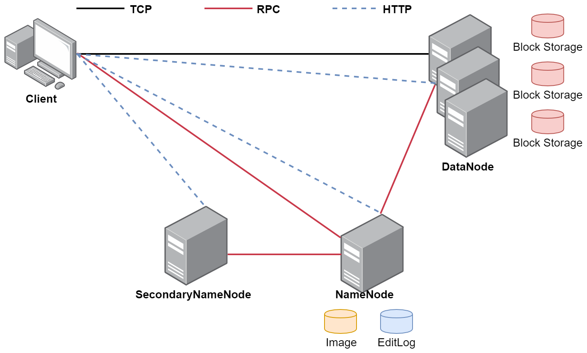
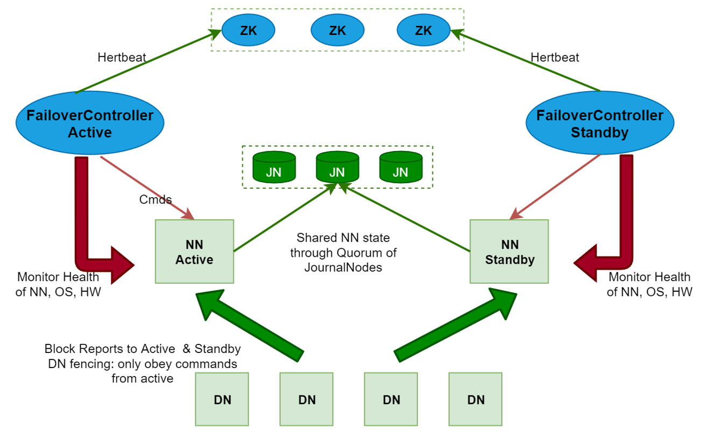
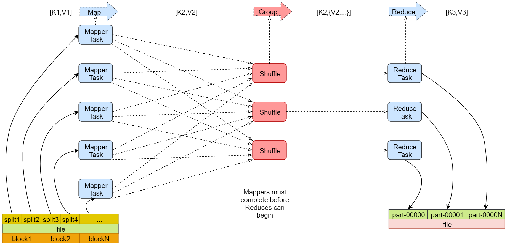
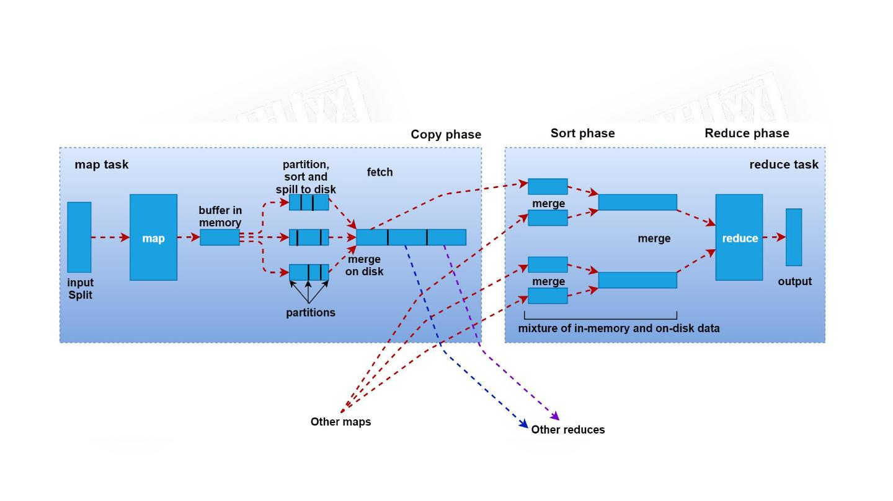

# 第1章 Hadoop

## 1 Hadoop简介

Hadoop适合海量数据分布式存储和分布式计算

Hadoop 3.x的细节优化：

- Java改为支持8及以上
- HDFS支持纠删码
- HDFS支持多NameNode
- MR任务级本地优化
- 多重服务默认端口变更



Hadoop主要包含三大组件：HDFS+MapReduce+YARN

- HDFS负责海量数据的`分布式存储`
- MapReduce是一个计算模型，负责海量数据的`分布式计算`
- YARN主要负责`集群资源的管理和调度`

## 2 下载并配置Hadoop

在root用户下设置免密码登录：
```shell
ssh-keygen -t rsa
cat ~/.ssh/id_rsa.pub  >> ~/.ssh/authorized_keys
```

修改hostname
```shell
hostname bigdata01
```

访问[Hadoop下载地址](https://archive.apache.org/dist/hadoop/common/)，下载hadoop-3.2.0安装包，在/data/soft目录下解压


### 2.1 修改/etc/profile
```shell
vim /etc/profile
```
添加
```shell
export HADOOP_HOME=/data/soft/hadoop-3.2.0
export PATH=.:$HADOOP_HOME/sbin:$HADOOP_HOME/bin:$PATH
```

**以下文件在{HADOOP_HOME}/etc/hadoop/目录下**

### 2.2 修改hadoop-env.sh
```shell
export JAVA_HOME=/usr/lib/jvm/java-8-openjdk-amd64
export HADOOP_LOG_DIR=/data/hadoop_repo/logs/hadoop
```

### 2.3 修改core-site.xml
```xml
<configuration>
	<property>
 		<name>fs.defaultFS</name>
 		<value>hdfs://bigdata01:9000</value>
 	</property>
 	<property>
 		<name>hadoop.tmp.dir</name>
 		<value>/data/hadoop_repo</value>
 	</property>
    <property>
        <name>hadoop.http.staticuser.user</name>
        <value>root</value>
    </property>
</configuration>
```

### 2.4 修改hdfs-site.xml
```xml
<configuration>
	<property>
		<name>dfs.replication</name>
		<value>1</value>
	</property>
</configuration>
```

### 2.5 修改mapred-site.xml
```xml
<configuration>
	<property>
		<name>mapreduce.framework.name</name>
		<value>yarn</value>
	</property>
</configuration>
```

### 2.6 修改yarn-site.xml
```xml
<configuration>
    <property>
        <name>yarn.nodemanager.aux-services</name>
        <value>mapreduce_shuffle</value>
    </property>
    <property>
        <name>yarn.nodemanager.env-whitelist</name>
        <value>JAVA_HOME,HADOOP_COMMON_HOME,HADOOP_HDFS_HOME,HADOOP_CONF_DIR,CLASSPATH_PREPEND_DISTCACHE,HADOOP_YARN_HOME,HADOOP_MAPRED_HOME</value>
    </property>
</configuration>
```

### 2.7 修改workers
```
bigdata01
```

**以下文件在{HADOOP_HOME}/sbin/目录下**

### 2.8 修改start-dfs.sh、stop-dfs.sh
在文件开头添加
```shell
HDFS_DATANODE_USER=root
HDFS_DATANODE_SECURE_USER=hdfs
HDFS_NAMENODE_USER=root
HDFS_SECONDARYNAMENODE_USER=root
```

### 2.9 修改start-yarn.sh、stop-yarn.sh
在文件开头添加
```shell
YARN_RESOURCEMANAGER_USER=root
HADOOP_SECURE_DN_USER=yarn
YARN_NODEMANAGER_USER=root
```

### 2.10 启动集群
第一次启动时，先初始化datanode，执行如下命令：
```shell
hdfs namenode -format
```
启动集群：
```
shart-all.sh
```
访问界面
- HDFS webui界面：http://bigdata01:9870
- YARN webui界面：http://bigdata01:8088

## 3 HDFS

HDFS是一种允许文件通过网络在多台主机上分享的文件系统，可以让多台机器上的多个用户分享文件和存储空间

### 3.1 HDFS常见Shell操作

```shell
hdfs dfs [-cmd] 
```

- -ls：查询指定路径信息
- -put：从本地上传文件
- -cat：查看HDFS文件内容
- -get：下载文件到本地
- -mkdir [-p]：创建文件夹
- -rm [-r]：删除文件/文件夹

### 3.2 HDFS案例实操

1. 统计HDFS根目录下的文件个数
```shell
hdfs dfs -ls / | grep / | wc -l
```

2. 每个文件的大小
```shell
hdfs dfs -ls / | grep / | awk '{print $8,$5}'
```

### 3.3 HDFS体系结构

- HDFS支持主从结构，主节点称为NameNode，支持多个；从节点称为DataNode，支持多个
- HDFS中还包含一个SecondaryNameNode进程

1. NameNode
	- NameNode是整个文件系统的管理节点
	- 它主要维护着整个文件系统的文件目录树，文件/目录的信息和每个文件对应的数据块列表，并且还负责接收用户的操作请求

2. SecondaryNameNode
    - 主要负责定期的把edits中的内容合并到fsimage中
    - 这个合并操作称为checkpoint，在合并的时候会对edits中的内容进行转换，生成新的内容保存到fsimage文件中
    - 注意：在NameNode的HA（高可用）架构中没有SecondaryNameNode进程，文件合并操作会由standby NameNode负责实现

3. DataNode
    - 提供真实文件数据的存储服务
    - HDFS会按照固定的大小，顺序对文件进行划分并编号，划分好的每一个块称一个Block，HDFS默认Block大小是128MB
    - HDFS中，如果一个文件小于一个数据块的大小，那么并不会占用整个数据块的存储空间
    - Replication：多副本机制，HDFS默认副本数量为3
    - 通过dfs.replication属性控制

### 3.4 DataNode总结 

**注意**：Block块存放在哪些DataNode上，只有DataNode自己知道，当集群启动的时候，DataNode会扫描自己节点上面的所有Block块信息，然后把节点和这个节点上的所有Block块信息告诉给NameNode。这个关系是每次重启集群都会动态加载的【这个其实就是集群为什么数据越多，启动越慢的原因】

### 3.5 NameNode总结

NameNode维护了两份关系：

- 第一份关系：File与Block list的关系，对应的关系信息存储在fsimage和edits文件中（当NameNode启动的时候会把文件中的元数据信息加载到内存中）
- 第二份关系：Datanode与Block的关系（当DataNode启动时，会把当前节点上的Block信息和节点信息上报给NameNode）

文件的元数据信息在NameNode里面都会占用150字节的存储空间。

### 3.6 HDFS的回收站

在core-site.xml添加配置
```xml
<property>
    <name>fs.trash.interval</name>
    <value>1440</value>
</property>
```
重启hadoop
```shell
stop-all.sh
start-all.sh
```

忽略回收站删除文件的命令：
```shell
hdfs dfs -rm -skipTrash /user.txt
```

- HDFS为每个用户创建一个回收站目录：`/user/用户名/.Trash/`
- 回收站中的数据都会有一个默认保存周期，过期未恢复则会被HDFS自动彻底删除
- 注意：HDFS的回收站默认是没有开启的，需要修改`core-site.xml`中的`fs.trash.interval`属性

### 3.7 HDFS的安全模式

- 集群刚启动时，HDFS会进入安全模式，此时无法执行操作
- 查看安全模式：`hdfs dfsadmin -safemode get`
- 离开安全模式：`hdfs dfsadmin -safemode leave`

### 3.8 案例：定时上传文件到HDFS

**案例需求**：例如日志文件为access_2020_01_01.log，每天上传到HDFS中  
**解决思路**：
1. 我们需要获取到昨天日志文件的名称
2. 在HDFS上面使用昨天的日期创建目录
3. 将昨天的日志文件上传到刚创建的HDFS目录中
4. 要考虑到脚本重跑，补数据的情况
5. 配置crontab任务

**解决方案**
1. 编写`uploadLogData.sh`文件
```shell
#!/bin/bash
# 获取昨天日期字符串
yesterday=$1
if [ "$yesterday" = "" ]
then
    yesterday=`date +%Y_%m_%d --date="1 days ago"`
fi
# 拼接日志文件路径信息
logPath=/data/log/access_${yesterday}.log
# 将日期字符串中的_去掉
hdfsPath=/log/${yesterday//_/}
# 在hdfs上创建目录
hdfs dfs -mkdir -p ${hdfsPath}
# 将数据上传到hdfs的指定目录中
hdfs dfs -put ${logPath} ${hdfsPath}
```

2. 配置crontab，编辑`/etc/crontab`文件
```shell
0 1 * * * root sh /data/shell/uploadLogData.sh >> /data/shell/uploadLogData.log
```

### 3.9 HDFS的高可用（HA）



- HDFS的HA，表示一个集群中存在多个NameNode，只有一个NameNode是处于Active状态，其它的是处于Standby状态
- Active NameNode（ANN）负责所有客户端的操作，Standby NameNode（SNN）用于同步ANN的状态信息，提供快速故障恢复能力
- 使用HA的时候，不能启动SecondaryNameNode

### 3.10 HDFS的高扩展（Federation）

- Federation可解决单一命名空间的一些问题，提供以下特性：HDFS集群扩展性、性能更高效、良好的隔离性

## 4 MapReduce

- MapReduce是一种分布式计算模型，主要用于搜索领域，解决海量数据的计算问题
- MapReduce有两个阶段组成：Map和Reduce



### 4.1 Map阶段

1. 框架会把输入文件（夹）划分为很多InputSplit，默认每个HDFS的Block对应一个InputSplit。通过RecordReader类，把每个InputSplit解析成一个个<k1,v1>。默认每一行数据，会被解析成一个<k1,v1>
2. 框架调用Mapper类中的map(...)函数，map函数的输入是<k1,v1>，输出是<k2,v2>。一个InputSplit对应一个Map Task
3. 框架对map函数输出的<k2,v2>进行分区。不同分区中的<k2,v2>由不同的Reduce Task处理，默认只有1个分区
4. 框架对每个分区中的数据，按照k2进行排序、分组。分组，指的是相同k2的v2分成一个组
5. 在Map阶段，框架可以执行Combiner操作【可选】
6. 框架会把Map Task输出的<k2,v2>写入Linux的磁盘文件中

### 4.2 Reduce阶段

1. 框架对多个Map Task的输出，按照不同的分区，通过网络Copy到不同的Reduce节点，这个过程称作Shuffle
2. 框架对Reduce节点接收到的相同分区的<k2,v2>数据进行合并、排序、分组
3. 框架调用Reducer类中的reduce方法，输入<k2,{v2...}>，输出<k3,v3>。一个<k2,{v2...}>调用一次reduce函数
4. 框架把Reduce的输出结果保存到HDFS中

### 4.3 MapReduce任务日志查看

在yarn-site.xml添加配置，开启YARN的日志聚合功能，把散落在NodeManager节点上的日志统一收集管理，方便查看日志
```xml
<property> 
    <name>yarn.log-aggregation-enable</name> 
    <value>true</value>
</property>
<property>
    <name>yarn.log.server.url</name>
    <value>http://bigdata01:19888/jobhistory/logs/</value>
</property>
```
重启Hadoop，并启动HistoryServer
```shell
stop-all.sh
start-all.sh
mapred --daemon start historyserver
```

使用命令查看任务执行的日志：
```shell
yarn logs -applicationId application_158771356
```

停止yarn任务：
```shell
yarn application -kill application_15877135678
```

### 4.4 Shuffle原理



1. 在Map阶段中，通过InputSplit过程产生一个Map任务，该任务在执行的时候会把
<k1,v1>转化为<k2,v2>，这些数据会先临时存储到一个内存缓冲区中，这个内存缓冲区的大小默认是100M（io.sort.mb属性），
2. 当达到内存缓冲区大小的80%（io.sort.spill.percent）即80M时，会把内
存中的数据溢写到本地磁盘中（mapred.local.dir），直到Map把所有的数据都计算完
3. 最后会把内存缓冲区中的数据一次性全部刷新到本地磁盘文件上
4. 数据会被shuffle线程分别拷贝到不同的reduce节点，不同Map任务中的相同分区的数据会在同一个reduce节点进行合并，合并以后会执行reduce的功能，最终产生结果数据。

**注**：shuffle其实是横跨Map端和Reduce端，主要是负责把Map端产生的数据通过网络拷贝到Reduce阶段进行统一聚合计算。

### 4.5 Hadoop中序列化机制

- 序列化：将内存中的对象信息转成二进制的形式，方便存储到文件中
- Hadoop实现了自己的序列化和反序列化机制，单独设计了一些`writable`的实现，例如`Longwritable`、`Text`等

**特点：**
1. 紧凑：高效使用存储空间
2. 快速：读写数据的额外开销小
3. 可扩展：可透明地读取老格式的数据
4. 互操作：支持多语言的交互

### 4.6 InputSplit

- 当文件剩余大小bytesRemaining与splitSize的比值大于1.1的时候，就继续切分，否则，剩下的直接作为一个InputSize（即当bytesRemaining/splitSize <= 1.1时，会停止划分，将剩下的作为一个InputSplit）
- 把不支持切割的文件作为一个InputSplit，比如压缩文件

### 4.7 RecordReader

- 每一个InputSplit都有一个RecordReader，作用是把InputSplit中的数据解析成Record，即<k1,v1>
- 如果这个InputSplit不是第一个InputSplit，将会丢掉读取出来的第一行，因为总是通过next()方法多读取一行（会多读取下一个InputSplit的第一行）
