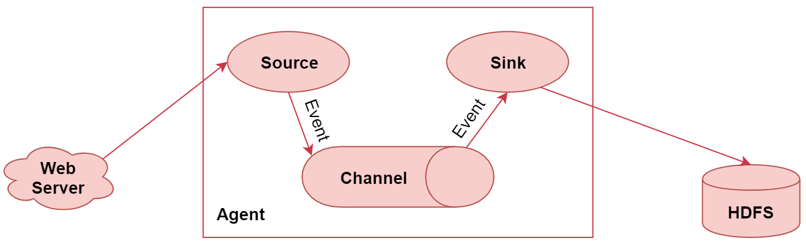

# 第3章 Flume

## 1 Flume简介



- Flume是一个高可用、高可靠、分布式的海量日志采集、聚合和传输的系统
- 主要特性：
	1. 它有一个简单、灵活的基于流的数据流结构（使用Event封装）
    2. 具有负载均衡机制和故障转移机制
    3. 一个简单可扩展的数据模型(Source、Channel、Sink)

- Source组件：
    1. 从外界采集各种类型数据，将数据传递给Channel
    2. 支持类型有文件、目录、端口、Kafka等
    3. Exec Source：实现文件监控；注意 tail -F（跟踪文件） 和 tail -f 的区别
    4. NetCat TCP/UDP Source： 采集指定端口(tcp、udp)的数据
    5. Spooling Directory Source：采集文件夹里新增的文件
    6. Kafka Source：从Kafka消息队列中采集数据

- Channel组件：
    1. 接受Source发出的数据，临时存储
    2. 支持类型有内存、文件，内存+文件、JDBC等
    3. Memory Channel：使用内存作为数据的存储，内存有限，临时存储
    4. File Channel：使用文件来作为数据的存储
    5. Spillable Memory Channel：使用内存和文件作为数据存储（即先存到内存中，如果内存中数据达到阈值再flush到文件中）

- Sink组件：
    1. 从Channel中读取数据并存储到指定目的地
    2. 表现形式：控制台、HDFS、Kafka等
    3. 注意：Channel中的数据直到进入目的地才会被删除，当Sink写入失败后，可以自动重写，不会造成数据丢失
    4. Logger Sink：将数据作为日志处理
    5. HDFS Sink：将数据传输到HDFS中
    6. Kafka Sink：将数据发送到kafka消息队列中

## 2 Flume部署

访问[flume下载地址](https://archive.apache.org/dist/flume/1.9.0/)，下载apache-flume-1.9.0-bin.tar.gz安装包，在/data/soft目录下解压

### 2.1 修改flume-env.sh文件
```shell
cd /data/soft/apache-flume-1.9.0-bin/conf
mv flume-env.sh.template flume-env.sh
```

### 2.2 示例
```shell
# example.conf: A single-node Flume configuration

# Name the components on this agent
a1.sources = r1
a1.sinks = k1
a1.channels = c1

# Describe/configure the source
a1.sources.r1.type = netcat
a1.sources.r1.bind = 0.0.0.0
a1.sources.r1.port = 44444

# Describe the sink
a1.sinks.k1.type = logger

# Use a channel which buffers events in memory
a1.channels.c1.type = memory
a1.channels.c1.capacity = 1000
a1.channels.c1.transactionCapacity = 100

# Bind the source and sink to the channel
a1.sources.r1.channels = c1
a1.sinks.k1.channel = c1
```

执行命令：
```shell
cd /data/soft/apache-flume-1.9.0-bin
bin/flume-ng agent --conf conf --conf-file conf/example.conf --name a1 -Dflume.root.logger=INFO,console
```

开启另一个Terminal，执行远程连接命令，并输入传输内容：
```shell
telnet localhost 44444
```

## 3 高级组件

相关配置需要参考[官方文档](https://flume.apache.org/releases/content/1.9.0/FlumeUserGuide.html)

- Source Interceptors：Source可以指定一个或者多个拦截器按先后顺序依次对采集到的数据进行处理
- Channel Selectors：Source发往多个Channel的策略设置
- Sink Processors：Sink发送数据的策略设置

- Event：
    1. Event是Flume传输数据的基本单位，也是事务的基本单位；在文本文件中，通常一行记录就是一个Event
    2. Event里有header和body；header类型为Map<String, String>
    3. 可以在Source中增加header的<key, value>，在Channel和Sink中使用header中的值

### 3.1 Source Interceptors

- 常见Interceptors类型：Timestamp Interceptor、Host Interceptor、Search and Replace Interceptor 、Static Interceptor、Regex Extractor Interceptor等

### 3.2 Channel Selectors

- Channel Selectors类型包括：Replicating Channel Selector(default)和Multiplexing Channel Selector
- Replicating：会将Source采集过来的Event发往所有Channel
- Multiplexing：会根据Event中header里面的值，将Event发往不同的Channel

### 3.3 Sink Processors

- Sink Processors类型包括：Default Sink Processor、Load balancing Sink Processor和Failover Sink Processor
- Default：是默认的不用配置sinkgroup；Load balancing是负载均衡；Failover是故障转移，后面需要定义sinkgroup

## 4 性能优化

- Flume优化
    1. 调整Flume进程的内存大小，建议设置1G~2G，内存设置太小可能导致频繁GC
    2. 启动多个Flume进程时，建议修改配置区分日志文件，复制多个conf目录，修改`log4j.properties`文件

- Flume进程监控
    1. Flume是一个单进程程序，会存在单点故障，所以需要有一个监控机制，发现Flume进程Down掉之后，需要重启
    2. 通过Shell脚本使用`jps`命令对Flume进程进行监控、告警之后并自动重启
