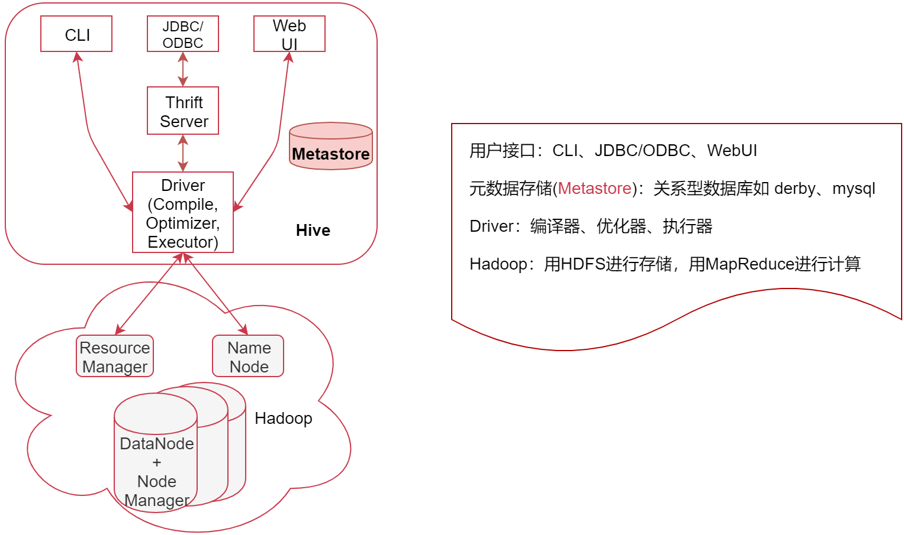

# 第4章 Hive

## 1 Hive简介

### 1.1 Hive系统架构



- Hive是建立在 Hadoop上的数据仓库基础构架，它提供了一系列的工具，可以进行数据提取、转化、加载（ ETL ）
- Hive定义了简单的类SQL查询语言，称为HQL，它允许熟悉SQL的用户直接查询Hadoop中的数据
- Hive包含SQL解析引擎，它会将SQL语句转译成MR Job，然后在Hadoop中执行
- Hive的数据存储基于Hadoop的HDFS
- Hive没有专门的数据存储格式，默认可以直接加载文本文件TextFile，还支持SequenceFile、RCFile等

### 1.2 Metastore

- Metastore是Hive元数据的集中存放地
- 元数据包括表的名字，表的列和分区及其属性，表的数据所在目录等
- Metastore默认使用内嵌的Derby数据库作为存储引擎，推荐使用Mysql数据库作为外置存储引擎

### 1.3 Hive与MySQL对比

|                  |    Hive    |  MySQL   |
| :--------------: | :--------: | :------: |
| **数据存储位置** |    HDFS    | 本地磁盘 |
|   **数据格式**   |  用户决定  | 系统决定 |
|   **数据更新**   |   不支持   |   支持   |
|     **索引**     | 有，但较弱 |    有    |
|     **执行**     | MapReduce  | Executor |
|   **执行延迟**   |     高     |    低    |
|   **可扩展性**   |     高     |    低    |
|   **数据规模**   |     大     |    小    |

## 2 Hive安装部署

访问[Hive官方网站](https://dlcdn.apache.org/hive/hive-3.1.2/)，下载apache-hive-3.1.2-bin.tar.gz安装包，在`/data/soft`目录下解压文件。

### 2.1 配置hive-env.sh 
```shell
cd apache-hive-3.1.2-bin/conf/
mv hive-env.sh.template hive-env.sh
```

在文件末尾添加以下内容：
```shell
export JAVA_HOME=/usr/lib/jvm/java-8-openjdk-amd64
export HIVE_HOME=/data/soft/apache-hive-3.1.2-bin
export HADOOP_HOME=/data/soft/hadoop-3.2.0
```

### 2.2 安装mysql数据库，并创建hive库
```
create database hive
```

### 2.3 配置hive-site.xml

```shell
cd apache-hive-3.1.2-bin/conf/
mv hive-default.xml.template hive-site.xml
```

在文件中添加以下内容：
```xml
<property>
    <name>javax.jdo.option.ConnectionURL</name>
    <value>jdbc:mysql://localhost:3306/hive?serverTimezone=Asia/Shanghai</value>
</property>
<property>
    <name>javax.jdo.option.ConnectionDriverName</name>
    <value>com.mysql.cj.jdbc.Driver</value>
</property>
<property>
    <name>javax.jdo.option.ConnectionUserName</name>
    <value>root</value>
</property>
<property>
    <name>javax.jdo.option.ConnectionPassword</name>
    <value>admin</value>
</property>
<property>
    <name>hive.querylog.location</name>
    <value>/data/hive_repo/querylog</value>
</property>
<property>
    <name>hive.exec.local.scratchdir</name>
    <value>/data/hive_repo/scratchdir</value>
</property>
<property>
    <name>hive.downloaded.resources.dir</name>
    <value>/data/hive_repo/resources</value>
</property>
```

删除第2315行内容，把hive.txn.xlock.iow对应的description标签内容删掉。

### 2.4 修改Hadoop的etc/hadoop/core-site.xml文件
```xml
<property>
	<name>hadoop.proxyuser.root.hosts</name>
	<value>*</value>
</property>
<property>
	<name>hadoop.proxyuser.root.groups</name>
	<value>*</value>
</property>
```

### 2.5 初始化Hive的Metastore
```shell
cd /data/soft/apache-hive-3.1.2-bin
bin/schematool -dbType mysql -initSchema
```

### 2.6 修改Hive数据库中表的编码
连接Hive的MySQL元数据的数据库，在hive库中执行如下SQL语句：
```sql
alter table COLUMNS_V2 modify column COMMENT varchar(256) character set utf8;
alter table TABLE_PARAMS modify column PARAM_VALUE varchar(4000) character set utf8;
```

### 2.6 删除Hive日志显示
重命名`/data/soft/apache-hive-3.1.2-bin/lib/log4j-slf4j-impl-2.10.0.jar`文件
```shell
cd /data/soft/apache-hive-3.1.2-bin/lib/
mv log4j-slf4j-impl-2.10.0.jar log4j-slf4j-impl-2.10.0.jar.bak
```

### 2.7 配置Hive日志
```
cd /data/soft/apache-hive-3.1.2-bin/conf
```

1. 执行以下命令，配置Hive日志信息

  ```shell
  mv hive-log4j2.properties.template hive-log4j2.properties
  ```
  
  修改`hive-log4j2.properties`文件内容：
  ```properties
  property.hive.log.level = WARN
  property.hive.root.logger = DRFA
  property.hive.log.dir = /data/hive_repo/log
  property.hive.log.file = hive.log
  property.hive.perflogger.log.level = INFO
  ```

2. 执行以下命令，配置Hive执行日志

  ```shell
  mv hive-exec-log4j2.properties.template hive-exec-log4j2.properties
  ```
  
  修改`hive-exec-log4j2.properties`文件内容：
  ```properties
  property.hive.log.level = WARN
  property.hive.root.logger = FA
  property.hive.query.id = hadoop
  property.hive.log.dir = /data/hive_repo/log
  property.hive.log.file = ${sys:hive.query.id}.log
  ```

### 2.8 启动Hive服务
```shell
cd /data/soft/apache-hive-3.1.2-bin
bin/hiveserver2
```
**注意**：一定要等到输出4行Hive Session ID之后，再使用客户端连接

## 3 Hive使用

### 3.1 创建表
```sql
create table t3_new(
  id int comment 'ID',
  stu_name string comment 'name' ,
  stu_birthday date comment 'birthday',
  online boolean comment 'is onlone'
)row format delimited 
fields terminated by '\t' 
lines terminated by '\n';
```

### 3.2 创建带Array的表
```sql
create table stu(
  id int,
  name string,
  favors array<string>
)row format delimited 
fields terminated by '\t'
collection items terminated by ','
lines terminated by '\n';
```

### 3.3 创建带Map的表
```sql
create table stu2(
  id int,
  name string,
  scores map<string,int>
)row format delimited 
fields terminated by '\t'
collection items terminated by ','
map keys terminated by ':'
lines terminated by '\n';
```

### 3.4 加载数据到表中
```sql
load data local inpath '/data/soft/hivedata/stu3.data' into table stu3;
```

### 3.5 创建桶表
```sql
create table bucket_tb(
   id int
)clustered by (id) into 4 buckets;
```

注意：需要从普通表中将数据插入到桶表中

### 3.6 创建视图
```sql
create view v1 as select id,stu_name from t3_new;
```

### 3.7 综合案例

**案例需求：**

通过Flume按天将日志数据采集到HDFS中对应目录，使用SQL按天统计每天的相关指标，数据样例如下：
```json
{"uid":"861848974414839801","nickname":"mick","usign":"","sex":1,"birthday":"","face":"","big_face":"","email":"abc@qq.com","mobile":"","reg_type":"102","last_login_time":"1494344580","reg_time":"1494344580","last_update_time":"1494344580","status":"5","is_verified":"0","verified_info":"","is_seller":"0","level":1,"exp":0,"anchor_level":0,"anchor_exp":0,"os":"android","timestamp":1494344580,"type":"user_info"}
```

**解决方法：**

1. 针对Flume的Source可以使用Exec Source，Channel可以使用基于文件的或者内存的，Sink使用HDFS Sink，在HDFS Sink的Path路径中需要使用`%Y%m%d`获取日期，将每天的日志数据采集到指定的HDFS目录中。
2. 需要对按天采集的日志数据建表，由于这份数据可能会被多种计算引擎使用，所以建议使用外部
表。
3. 在实际工作中，离线计算的需求大部分都是按天计算的，所以在这里最好在表中增加日期这个分区字段，最终决定使用外部分区表。
4. 针对Json数据，先创建外部分区表，再创建视图，解析Json数据中的字段

**实现方法：**

1. 创建分区表
```sql
create external table ex_par_more_type(
log string
)partitioned by(dt string,d_type string) 
 row format delimited 
 fields terminated by '\t'
 location '/moreType';
```

2. 添加分区
```sql
# 还需要创建userInfo和videoInfo
alter table ex_par_more_type add  partition(dt='20200504',d_type='giftRecord') location '/moreType/20200504/giftRecord';
```

3. 创建视图
```sql
# 还需要创建userInfo和videoInfo
reate view gift_record_view as select 
get_json_object(log,'$.send_id') as send_id,
get_json_object(log,'$.good_id') as good_id,
get_json_object(log,'$.video_id') as video_id,
get_json_object(log,'$.gold') as gold,
dt
from ex_par_more_type
where d_type='giftRecord';
```

4. 创建脚本
```shell
#!/bin/bash
# 每天凌晨1点定时添加当天日期的分区
if [ "a$1" = "a" ]
then
	dt=`date +%Y%m%d`
else
	dt=$1
fi
# 指定添加分区操作
hive -e "
alter table ex_par_more_type add if not exists  partition(dt='${dt}',d_type='giftRecord') location '/moreType/${dt}/giftRecord';
alter table ex_par_more_type add if not exists partition(dt='${dt}',d_type='userInfo') location '/moreType/${dt}/userInfo';
alter table ex_par_more_type add if not exists  partition(dt='${dt}',d_type='videoInfo') location '/moreType/${dt}/videoInfo';
"
```

5. 配置crontab，每天执行一次
```shell
00 01 * * * root /bin/bash /data/soft/hivedata/addPartion.sh >> /data/soft/hivedata/addPartion.log
```

## 4 Hive高级函数应用

### 4.1 分组排序取TopN

使用`row_number()`（对数据编号，从1开始）和`over()`（把数据划分到一个窗口，加上`partition by`，按照字段对数据进行分组，使用`order by`按照字段进行排序）
```sql
select * from
(
select *,row_number() over(partition by sub order by score desc) as num from student_score
) s where s.num<=3;
```

- 可以使用`rank()`替代`row_number()`，表示上下两条记录的score相等时，记录的行号是一样的，但下一个score值的行号递增N
- 可以使用`dense_rank()`替代`row_number()`，表示上下两条记录的score相等时，下一个score值的行号递增1

### 4.2 行转列

使用`concat_ws()`（根据指定的分隔符拼接多个字段的值）、`collect_set()`（返回一个set集合，集合汇中的元素不重复） 、`collect_list()`（返回一个list集合，集合中的元素会重复）

```sql
select name,collect_list(favor) as favor_list from student_favors group by name;
```

### 4.3 列转行

使用`split()`（接受一个字串符和切割规则，就类似于java中的split函数，使用切割规则对字符串中的数据进行切割，最终返回一个array数组）、`explode()`（表示把数组中的每个元素转成一行）和`lateral view`（可以对数据产生一个支持别名的虚拟表）

```sql
select name,favor_new from student_favors_2 lateral view explode(split(favorlist,',')) table1 as favor_new;
```

### 4.4 ditribute by

- `ditribute by`：只会根据指定的key对数据进行分区，但是不会排序。一般情况下可以和`sort by`结合使用，先对数据分区，再进行排序，两者结合使用的时候，`distribute by`必须要写在`sort by`之前。

### 4.5 cluster by

- `cluster by`：是`distribute by`和`sort by`的简写形式，即`cluster by id`等于`distribute by id sort by id`

## 5 应用实例

### 5.1 解决数据倾斜问题的SQL语句
```sql
SELECT a.Key, SUM(a.Cnt) AS Cnt
FROM (
 SELECT Key, COUNT(*) AS Cnt
 FROM TableName GROUP BY Key,
 CASE
 WHEN Key = 'KEY001' THEN Hash(Random()) % 50
 ELSE 0
 END
) a GROUP BY a.Key;
```
其中`CASE WHEN`将数据打散，然后再进行`GROUP BY`

### 5.2 解决数据倾斜方案

- 参数调节：hive.groupby.skewindata=true
有数据倾斜的时候进行负载均衡，当选项设定为true，生成的查询计划会有两个MR Job。第一个MR Job中，Map的输出结果集合会随机分布到Reduce中，每个Reduce做部分聚合操作，并输出结果，这样处理的结果是相同的Group By Key有可能被分发到不同的Reduce中，从而达到负载均衡的目的；第二个MR Job再根据预处理的数据结果，按照Group By Key分布到Reduce中（这个过程可以保证相同的Group By Key被分布到同一个Reduce中），最后完成最终的聚合操作。

- SQL语句调节：
    1. 大小表Join：使用map join让小的维度表（1000条以下的记录条数）先进内存。在map端完成reduce。
    2. 大表Join大表：把空值的key变成一个字符串加上随机数，把倾斜的数据分到不同的reduce上，由于null值关联不上，处理后并不影响最终结果。
    3. count distinct大量相同特殊值：在count distinct时，将值为空的情况单独处理，如果是计算count distinct，可以不用处理，直接过滤，在最后结果中加1。如果还有其他计算，需要进行group by，可以先将值为空的记录单独处理，再和其他计算结果进行union。
    4. 去重求和：采用sum() group by的方式来替换count(distinct)完成计算。