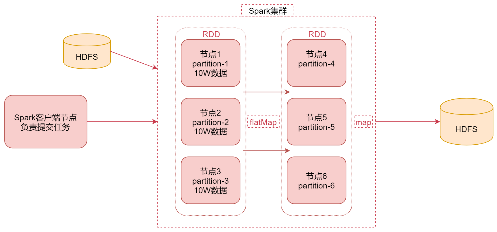
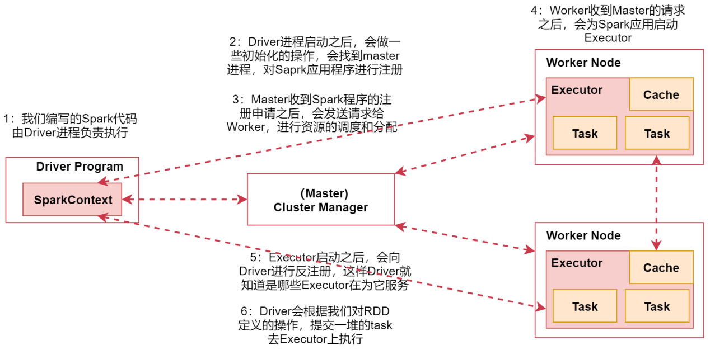

# 第6章 Spark

## 1 Spark简介

- Spark是一个用于大规模数据处理的统一计算引擎，基于内存计算
- Spark使用最先进的DAG调度器、查询优化器和物理执行引擎，实现了高性能的批处理和流处理
- 可以使用多种编程语言快速编写应用程序，例如Java、Scala、Python、R和SQL
- Spark提供了80多个高阶函数，可以轻松构建Spark任务
- Spark提供了Core、SQL、Streaming、MLlib、GraphX等技术组件，可以一站式地完成大数据领域的离线批处理、SQL交互式查询、流式实时计算，机器学习、图计算等常见的任务
- 在Hadoop YARN、Mesos或Kubernetes上使用Spark集群

- Spark和Hadoop对比
    1. 综合能力：Spark是一个综合性质的计算引擎，Hadoop既包含MapReduce（计算），还包含HDFS（存储）和YARN（资源管理）
    2. 计算模型：Spark任务可以包含多个计算操作，轻松实现复杂迭代计算，Hadoop中MapReduce任务只包含Map和Reduce阶段，不够灵活
    3. 处理速度：Spark任务的数据是存放在内存中的，而Hadoop中MapReduce 任务是基于磁盘的

## 2 Spark安装部署

- Standalone：独立集群
- ON YARN：共用Hadoop集群资源【 推荐使用 】

访问[Spark官网](https://archive.apache.org/dist/spark/spark-3.1.3/)，下载spark-3.1.3-bin-hadoop3.2.tgz安装包，在`/data/soft`目录下解压安装部署

**注**：以下使用ON YARN模式部署

### 2.1 解压并重命名文件
```shell
cd /data/soft
tar -zxvf spark-3.1.3-bin-hadoop3.2.tgz
cd spark-3.1.3-bin-hadoop3.2/conf/
```

### 2.2 修改spark-env.sh

```shell
mv spark-env.sh.template spark-env.sh
```

在spark-env.sh文件中添加以下内容：

```shell
export JAVA_HOME=/usr/lib/jvm/java-8-openjdk-amd64
export HADOOP_CONF_DIR=/data/soft/hadoop-3.2.0/etc/hadoop
```

### 2.3 配置Spark historyServer

```shell
mv spark-defaults.conf.template spark-defaults.conf
```

在spark-defaults.conf文件中添加以下内容
```properties
spark.eventLog.enabled=true
spark.eventLog.compress=true
spark.eventLog.dir=hdfs://bigdata01:9000/tmp/logs/root/logs
spark.history.fs.logDirectory=hdfs://bigdata01:9000/tmp/logs/root/logs
spark.yarn.historyServer.address=http://bigdata01:18080
```

在spark-env.sh文件中添加以下内容
```shell
export SPARK_HISTORY_OPTS="-Dspark.history.ui.port=18080 -Dspark.history.fs.logDirectory=hdfs://bigdata01:9000/tmp/logs/root/logs"
```

启动Spark historyServer
```
sbin/start-history-server.sh
```

### 2.4 部署验证

首先需要启动Hadoop：
```shell
start-all.sh
mapred --daemon start historyserver
```

执行示例代码命令：
```shell
bin/spark-submit --class  org.apache.spark.examples.SparkPi --master yarn --deploy-mode cluster examples/jars/spark-examples_2.12-3.1.3.jar
```


## 3 Spark工作原理与系统架构

### 3.1 Spark工作原理



1. 通过Spark客户端提交任务到Spark集群
2. Spark任务在执行的时候会读取数据源HDFS中的数据，将数据加载到内存中，转化为RDD
3. 针对RDD调用一些高阶函数对数据进行处理，中间可以调用多个高阶函数
4. 把计算出来的结果数据写到HDFS中

### 3.2 RDD

- RDD通常通过Hadoop上的文件，即HDFS文件进行创建，也可以通过程序中的集合来创建
- RDD是Spark提供的核心抽象，全称为Resillient Distributed Dataset，即弹性分布式数据集
- 弹性：RDD数据默认情况下存放在内存中，但是在内存资源不足时，Spark也会自动将RDD数据写入磁盘
- 分布式：RDD在抽象上来说是一种元素数据的集合，它是可以被分区的，每个分区分布在集群中的不同节点上，从而让RDD中的数据可以被并行操作
- 容错性：RDD最重要的特性就是提供了容错性，可以自动从节点失败中恢复过来

### 3.3 Spark架构的相关进程

- Driver：我们编写的Spark程序由Driver进程负责执行
- Master：集群的主节点中启动的进程
- Worker：集群的从节点中启动的进程
- Executor：由Worker负责启动的进程
- Task：由Executor负责启动的线程，用于真正执行任务

### 3.4 Spark架构原理



## 4 Transformation

- Transformation会针对已有的RDD创建一个新的RDD
- Transformation的特性：lazy

常用Transformation方法：

- map：将RDD中的每个元素进行处理，一进一出
- filter：对RDD中每个元素进行判断，返回true则保留
- flatMap：与map类似，但是每个元素都可以返回一个或多个新元素
- groupByKey：根据key进行分组，每个key对应一个Iterable\<value\>
- reduceByKey：对每个相同key对应的value进行reduce操作
- sortByKey：对每个相同key对应的value进行排序操作(全局排序)
- join：对两个包含<key,value>对的RDD进行join操作
- distinct：对RDD中的元素进行全局去重

## 5 Action

- Action主要对RDD进行最后的操作，比如遍历、reduce、保存到文件等，并且还可以把结果返回给Driver程序
- 执行Action操作才会触发一个Spark Job的运行，从而触发这个Action之前所有的Transformation的执行

常用Action方法：

- reduce：将RDD中的所有元素进行聚合操作
- collect：将RDD中所有元素获取到本地客户端(Driver)
- take(n)：获取RDD中前n个元素
- count：获取RDD中元素总数
- saveAsTextFile：将RDD中元素保存到文件中，对每个元素调用toString
- countByKey：对每个key对应的值进行count计数
- foreach：遍历RDD中的每个元素

## 6 RDD持久化原理

- 当对RDD执行持久化操作时，每个节点都会将自己操作的RDD的partition持久化到内存中，并且在之后对该RDD的反复使用中，直接使用内存缓存的partition
- 要持久化一个RDD，只要调用其cache()或者persist()方法
- cache()和persist()的区别：cache()是persist()的一种简化方式，如果需要从内存中清除缓存，可以使用unpersist()方法

- 选择RDD持久化策略的规则：
    1. 优先使用`MEMORY_ONLY`，纯内存速度最快，而且没有序列化不需要消耗CPU进行反序列化操作
    2. `MEMORY_ONLY_SER`，将数据进行序列化存储，纯内存操作还是非常快，只是要消耗CPU进行反序列化

## 7 共享变量

### 7.1 共享变量的工作原理

- 默认情况下，一个算子函数中使用到了某个外部的变量，那么这个变量的值会被拷贝到每个task中，此时每个task只能操作自己的那份变量数据

### 7.2 Broadcast Variable

- Broadcast Variable会将使用到的变量，仅仅为每个节点拷贝一份，更大的用处是优化性能，减少网络传输以及内存消耗
- 通过调用SparkContext的broadcast()方法，针对某个变量创建广播变量【广播变量是只读的】，可以通过广播变量的value()方法获取值

### 7.3 Accumulator

- Accumulator用于多个节点对一个变量进行共享性的操作
- 注意：Accumulator只提供了累加的功能，在task中只能对Accumulator进行累加操作，不能读取它的值。只有Driver进程中才可以读取Accumulator的值

## 8 面试题

**题目：**

sortBykey如何实现全局排序的？

**解答：**

1. sortBykey通过RangePartitioner实现根据数据范围进行分区
2. 根据原始数据进行抽样，把同一个区间的数据分到一个分区中
3. 在每个分区中进行局部排序（分而治之）
4. 将每个分区整合起来，得到最终结果