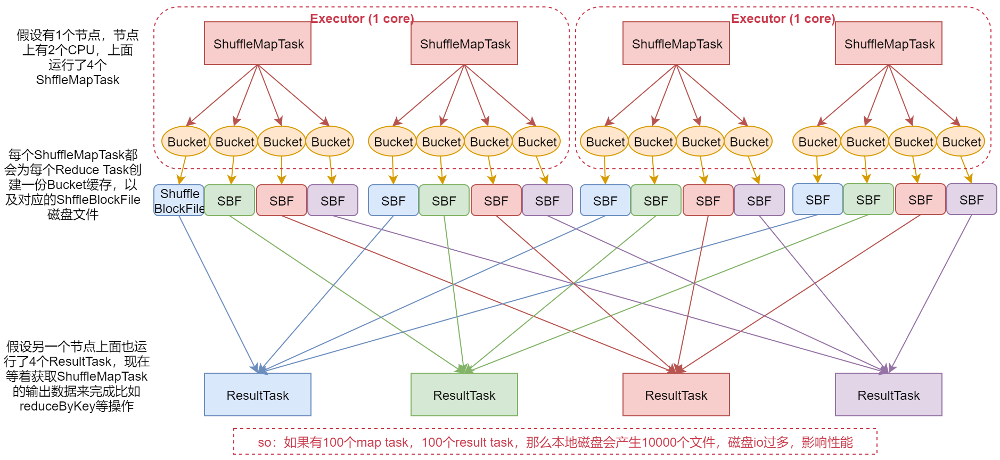
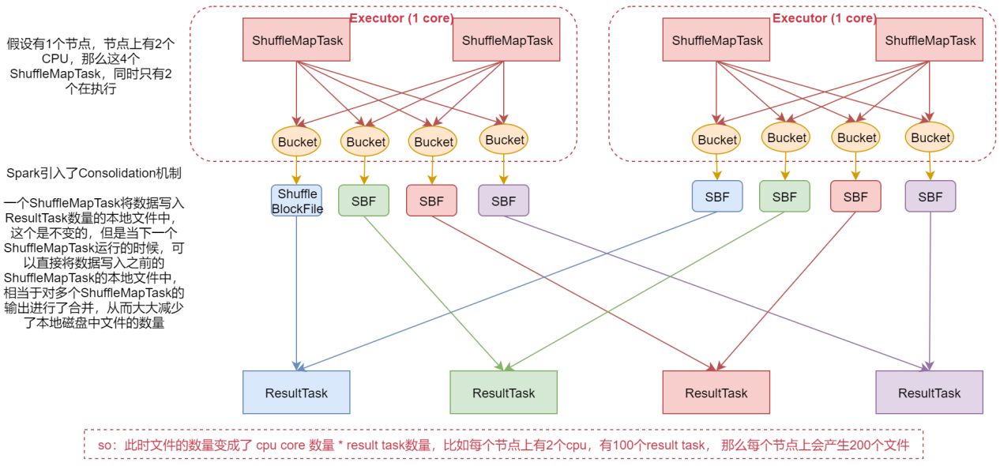
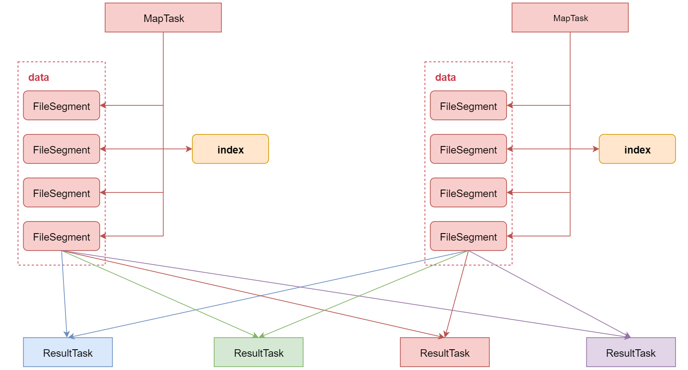

# 第7章 Spark性能优化

## 1 高级特性

### 1.1 窄依赖与宽依赖

- 窄依赖(Narrow Dependency)：指父RDD的每个分区只被子RDD的一个分区所使用，例如map、filter等
- 宽依赖(Shuffle Dependency)：父RDD的每个分区都可能被子RDD的多个分区使用，例如groupByKey、reduceByKey

### 1.2 Stage

- Spark Job会被划分为多个Stage，每一个Stage是由一组并行的Task组成的
- Stage的划分依据就是看是否产生了Shuflle(即宽依赖)，遇到一个Shuffle操作就会被划分为前后两个Stage，即从后往前，遇到宽依赖就切割Stage

### 1.3 三种提交模式

1. Standalone模式：spark-submit --master spark://bigdata01:7077 
2. yarn client模式：spark-submit  --master yarn --deploy-mode client 
3. yarn cluster模式：spark-submit  --master yarn --deploy-mode cluster

## 2 Shuffle机制分析

### 2.1 未优化的Hash Based Shuffle

ShuffleMapTask会把所有的数据都写入Bucket缓存之后，才会刷写到对应的磁盘文件中，但是如果map端数据过多，那么很容易造成内存溢出。

### 2.2 优化后的Hash Based Shuffle

文件的数量变成了CPU core数量\*ResultTask数量，比如每个节点上有2个CPU，有100个ResultTask，那么每个节点上会产生200个文件，这个时候文件数量就变得少多了

### 2.3 Sort Based Shuffle

为了减少内存的使用，在内存不够用的时候，可以将内存中的数据溢写到磁盘，结束的时候，再将这些溢写的文件联合内存中的数据一起进行归并，从而减少内存的使用量。一方面，文件数量显著减少；另一方面，减少缓存所占用的内存大小，而且同时避免GC的风险和频率。

## 3 checkpoint

### 3.1 checkpoint简介

- 针对Spark Job，如果担心某些关键的（在后面会反复使用的）RDD，由于节点故障导致数据丢失，可以针对该RDD启动checkpoint机制，实现容错和高可用
- 首先调用SparkContext的setCheckpointDir()方法，设置一个容错的文件系统目录(HDFS)，然后对RDD调用checkpoint()方法

### 3.2 checkpoint流程

1. SparkContext设置checkpoint目录，用于存放checkpoint的数据；对RDD调用checkpoint方法，它会被RDDCheckpointData对象进行管理，此时该RDD的checkpoint状态会被设置为Initialized；
2. 待RDD所在的job运行结束，会调用job中最后一个RDD的doCheckpoint方法，该方法会沿着RDD的血缘关系向上查找被checkpoint方法标记过的RDD，将其状态从Initialized设置为CheckpointingInProgress；
3. 启动一个单独的job，将血缘关系中标记为CheckpointingInProgress的RDD执行checkpoint操作，将其数据写入checkpoint目录；
4. 将数据写入checkpoint目录后，会将RDD状态改变为Checkpointed，并会改变RDD的血缘关系，即清除RDD所有依赖的RDD，最后会设置其父RDD为新创建的CheckpointRDD。

## 4 Spark性能优化

### 4.1 高性能序列化类库

- Spark倾向于序列化的便捷性，默认使用了Java序列化机制
- Java序列化机制的性能并不高，序列化的速度相对较慢，而且序列化以后的数据，相对来说比较大，比较占用内存空间
- Spark提供了两种序列化机制：Java序列化和Kryo序列化

- Kryo序列化：
    1. Kryo序列化比Java序列化更快 ，而且序列化后的数据更小通常比Java序列化的数据要小10倍左右
    2. 如果要使用Kryo序列化机制，首先要用SparkConf将Spark序列化器设置为KryoSerializer
    3. 使用Kryo时，针对需要序列化的类，需要预先进行注册，这样才能获得最佳性能，如果不注册，Kryo必须时刻保存类型的全类名，反而占用不少内存
    4. 需要调用SparkConf.set()方法，设置`spark.kryoserializer.buffer.mb`参数的值，将其调大，默认值为2，单位是MB

### 4.2 持久化或者checkpoint

- 针对程序中多次被transformation或者action操作的RDD进行持久化操作，避免对一个RDD反复进行计算，再进一步优化，使用 序列化(Kryo)的持久化级别
- 为了保证RDD持久化数据在可能丢失的情况下，还能实现高可靠，则需要对RDD执行Checkpoint操作

### 4.3 JVM垃圾回收调优

- 默认情况下，Spark使用每个executor 60%的内存空间来缓存RDD，那么只有40%的内存空间来存放算子执行期间创建的对象，可能会导致垃圾回收频繁发生
- 通过参数`spark.storage.memoryFraction`来修改比例
- 提高Executor内存：在spark-submit命令中，调整`--executor-memory 1G`

### 4.4 提高并行度

- 要尽量设置合理的并行度，来充分地利用集群的资源，才能充分提高Spark程序的性能
- 可以手动使用textFile()、parallelize()等方法的第二个参数来设置并行度，也可以使用`spark.default.parallelism`参数，来设置统一的并行度，Spark官方推荐，给集群中的每个cpu core设置2~3个task
- 在spark-submit命令中，设置`--num-executors 5`

在spark-submit脚本中经常配置的一些参数：
> --name mySparkJobName：指定任务名称  
--class com.xxxx：指定入口类  
--master yarn：指定集群地址，on yarn模式指定yarn  
--deploy-mode cluster：client代表yarn-client，cluster代表yarn-cluster  
--executor-memory 1G：executor进程的内存大小，实际工作中可以设置为2~4G即可  
--num-executors 2：分配多少个executor进程  
--executor-cores 2：一个executor进程分配多少个cpu core  
--driver-cores 1：driver进程分配多少core，默认为1  
--driver-memory 1G：driver进程的内存，如果需要使用类似于collect之类的action算子向Driver端拉取数据，则这里可以设置大一些  
--jars fastjson.jar,abc.jar：在这里可以设置job依赖的第三方jar包  
--conf "spark.default.parallelism=10"：可以动态指定一些spark任务的参数，指定多个参数可以通过多个--conf指定，或者在一个--conf后面的双引号中指定多个，多个参数之间用空格隔开即可

### 4.5 数据本地化

数据本地化级别：

- PROCESS_LOCAL（进程本地化）：数据和计算它的代码在同一个JVM进程中
- NODE_LOCAL（节点本地化）：数据和计算它的代码在一个节点上，但是不在一个JVM进程中
- NO_PREF：数据从哪里过来，性能都是一样的
- RACK_LOCAL：数据和计算它的代码在一个机架上，通过网络传输
- ANY：数据可能在任意地方，比如其它网络环境内，或者其它机架上

本地化优化方式：

- Spark默认会等待指定时间，期望task要处理的数据所在的节点上的executor空闲出一个cpu，从而将task分配过去，只要超过了时间，那么Spark就会将task分配到其它任意一个空闲的executor上
- 可以设置spark.locality系列参数，来调节Spark等待task可以进行数据本地化的时间

### 4.6 算子优化

1. map和mapPartitions
    - map：一次处理一条数据
    - mapPartitions：一次处理一个分区的数据

2. foreach和foreachPartition
    - foreach：一次处理一条数据
    - foreachPartition：一次处理一个分区的数据

3. repartition
    - 可以调整RDD的并行度
    - 可以解决RDD中数据倾斜的问题

4. reduceByKey：如果能用reduceByKey，那就用reduceByKey，因为它会在map端先进行本地combine，可以大大减少要传输到reduce端的数据量，减小网络传输的开销。

## 5 Spark SQL

### 5.1 Spark SQL简介

- Spark SQL是Spark的一个模块，主要用于进行结构化数据的处理，它提供的最核心的编程抽象，就是 DataFrame
- DataFrame=RDD+Schema ，它其实和关系型数据库中的表非常类似，DataFrame可以通过很多来源进行构建

### 5.2 DataFrame的SQL操作

- 将DataFrame注册为一个临时表
- 使用sparkSession中的SQL函数执行SQL语句

### 5.3 RDD转换为DataFrame

- 反射方式：Scala中导入隐式转换`import sparkSession.implicits._`，调用RDD的`toDF()`方法；Java中使用`sparkSession.createDataFrame(stuRDD, Student.class);`，其中Student类必须声明为public，并且必须实现序列化
- 编程方式：Scala中指定元数据信息，调用StructType类和StructField类进行定义；Java中使用`DataTypes.createStructType()`和`DataTypes.createStructField()`方法定义元数据信息

### 5.4 SaveMode

- SaveMode.ErrorIfExists(默认)：如果目标位置已经存在数据，那么抛出一个异常
- SaveMode.Append：如果目标位置已经存在数据，那么将数据追加进去
- SaveMode.Overwrite：如果目标位置已经存在数据，那么就将已经存在的数据删除，用新数据进行覆盖
- SaveMode.Ignore 如果目标位置已经存在数据，那么就忽略，不做任何操作

