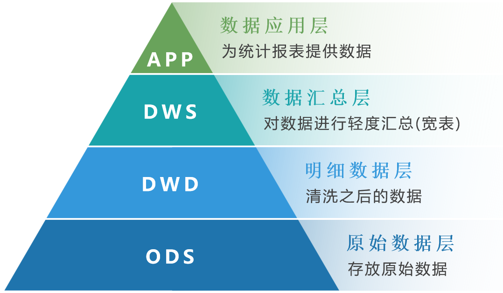
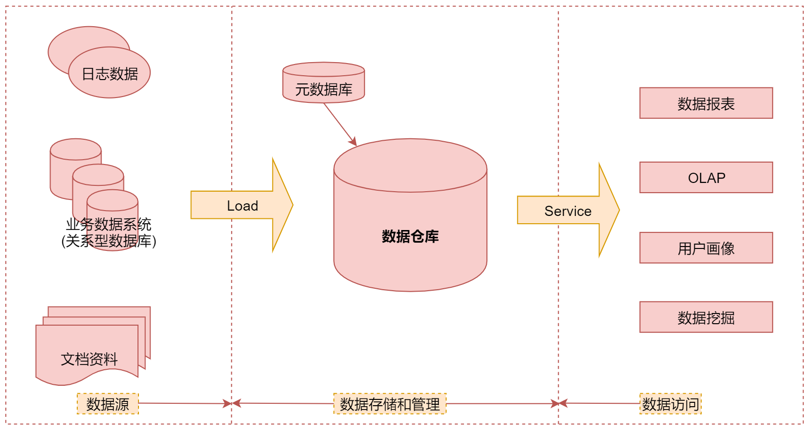

# 第8章 数据仓库

## 1 数据仓库简介

- 数据仓库(Data Warehouse)是一个面向主题的、集成的、稳定的且随时间变化的数据集合，用于支持管理人员的决策
- 面向主题：数据仓库侧重于数据分析工作，是按照主题存储的。
- 集成：数据仓库中的数据是在对原有分散的数据库数据抽取、清理的基础上经过系统加工、汇总和整理得到的，必须消除源数据中的不一致性，以保证数据仓库内的信息是关于整个企业的一致的全局信息。
- 稳定：数据仓库的数据主要供企业决策分析使用，通常只需要定期的加载、刷新。
- 变化：数据仓库中的数据通常包含历史信息，它里面记录了企业从过去某一时间点(如开始应用数据仓库的时间)到目前的各个阶段的信息，通过这些信息，可以对企业的发展历程和未来趋势做出分析和预测。

## 2 基础知识

### 2.1 事实表和维度表

- 事实表：保存了大量业务数据的表
- 维度表：存放了一个对象的属性或者特征，例如：时间维度，地理区域维度，年龄维度

### 2.2 数据库三范式

- 第一范式（1NF）：数据库表的每一列都是不可分割的原子数据项
- 第二范式（2NF）：表示在1NF的基础上，数据库表中每一列都和主键相关，不能只和主键的某一部分相关（针对联合主键而言）
- 第三范式（3NF）：要求一个数据库表中不包含已在其它表中包含的非主键字段

### 2.3 数据仓库建模方式

- ER实体模型：满足数据库第三范式的模型
- 维度建模模型：基于事实表和维度表进行维度建模，又分为星型模型和雪花模型
	- 星形模型：一般采用降维的操作，利用冗余来避免模型过于复杂，提高易用性和分析效率
	- 雪花模型：维度表的设计更加规范，一般符合3NF
- Data Vault模型：在ER模型的基础上衍生而来，模型设计的初衷是有效的组织基础数据层，使之易扩展、灵活的应对业务的变化，同时强调历史性、可追溯性和原子性，不要求对数据进行过度的一致性处理；并非针对分析场景所设计。
- Anchor模型：对Data Vault模型做了更近一步的规范化处理，初衷是为了设计高度可扩展的模型，核心思想是所有的扩张只添加而不修改，于是设计出的模型基本变成了k-v结构的模型。

星形模式和雪花模型的对比：
- 冗余：雪花模型符合业务逻辑设计，采用3NF设计，有效降低数据冗余；星型模型的维度表设计不符合3NF，反规范化，维度表之间不会直接相关，并且牺牲部分存储空间
- 性能：雪花模型由于存在维度间的关联，采用3NF降低冗余，通常在使用过程中，需要连接更多的维度表，导致性能偏低；星型模型违反三范式，采用降维的操作将维度整合，以存储空间为代价有效降低维度表连接数，性能比雪花模型高

## 3 数据仓库分层

### 3.1 分层的原因

1. 清晰的数据结构：每一个分层的数据都有它的作用域，这样在使用表的时候能更方便地定位和理
解。
2. 数据血缘追踪：由于最终需要给业务方呈现的是一个能直接使用的业务表，但是它的来源有很多，如果有一张来源表出问题了，希望能够快速准确地定位到问题，并清楚它的危害范围，分层之后就很好定位问题，以及可以清晰的知道它的危害范围。
3. 减少重复开发：规范数据分层，开发一些通用的中间层数据，能够减少重复计算。
4. 把复杂问题简单化：将一个复杂的任务分解成多个步骤来完成，每一层只处理单一的步骤，比较简单和容易理解。而且便于维护数据的准确性， 当数据出现问题之后，可以不用修复所有的数据，只需要从有问题的步骤开始修复。

### 3.2 分层设计

数据清洗原则：
1. 数据唯一性校验
2. 数据完整性校验
3. 数据合法性校验

### 3.3 典型的数据仓库系统架构

