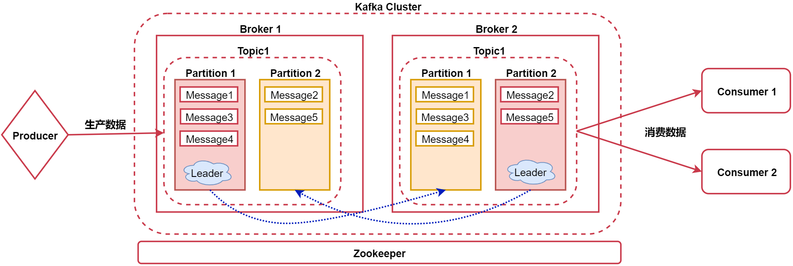

# 第9章 Kafka

## 1 消息队列

- 消息队列主要提供生产、消费接口供外部调用，进行数据的存储和读取
- 消息队列大致可以分为两种：点对点(P2P)、发布订阅(Pub/Sub)
	- 共同点：数据的处理流程是一样的，消息生产者生产消息发送到queue中，然后消息消费者从queue中读取并且消费消息。
	- 不同点：点对点(p2p)模型包含消息队列(Queue)、发送者(Sender)、接收者(Receiver)，其中一个生产者生产的消息只有一个消费者(Consumer)（消息一旦被消费，就不在消息队列中）消费。

## 2 Kafka简介

- Kafka是一个高吞吐量 的、 持久性的、 分布式发布订阅消息系统
- 高吞吐量：满足每秒百万级别消息的生产和消费
- 持久性：有一套完善的消息存储机制，确保数据高效安全的持久化。
- 分布式：它是基于分布式的扩展和容错机制



其中：
- Broker：消息代理，Kafka集群的节点
- Topic：消息主题
- Partition：物理分组（分区），一个Topic可以分为多个分区
- Leader：负责接收用户的读写请求
-  Message：消息

## 3 Kafka安装部署

**注**：以下均采用单机模式部署。

### 3.1 Zookeeper部署

访问[Zookeeper官网](https://zookeeper.apache.org/releases.html)，下载apache-zookeeper-3.5.8-bin.tar.gz安装包，在`/data/soft`中解压并修改配置

```shell
cd /data/soft
tar -xvf apache-zookeeper-3.5.8-bin.tar.gz
cd apache-zookeeper-3.5.8-bin
```

重命名zoo_sample.cfg文件：

```shell
cd conf
mv zoo_sample.cfg zoo.cfg
```

修改zoo.cfg文件内容
```properties
dataDir=/data/soft/apache-zookeeper-3.5.8-bin/data
```

启动Zookeeper
```shell
cd /data/soft/apache-zookeeper-3.5.8-bin
bin/zkServer.sh start
```

停止Zookeeper
```shell
bin/zkServer.sh stop
```

### 3.2 Kafka部署

访问[Kafka官网](https://kafka.apache.org/downloads)，下载kafka_2.12-2.4.1.tgz安装包，在`/data/soft`解压并修改配置

```shell
cd /data/soft
tar -xvf kafka_2.12-2.4.1.tgz
cd kafka_2.12-2.4.1
```

修改server.properties文件内容
```properties
log.dirs=/data/soft/kafka_2.12-2.4.1/kafka-logs
```

启动Kafka
```shell
cd /data/soft/kafka_2.12-2.4.1
bin/kafka-server-start.sh -daemon config/server.properties
```

## 4 Kafka基本操作

### 4.1 操作Topic

1. 新增Topic

```shell
bin/kafka-topics.sh --create --zookeeper localhost:2181 --partitions 1 --replication-factor 1 --topic hello
```

2. 查看Topic

```shell
bin/kafka-topics.sh --list --zookeeper localhost:2181
```

3. 查看Topic详细信息
```shell
bin/kafka-topics.sh --describe --zookeeper localhost:2181 --topic hello
```

4. 删除Topic
```shell
bin/kafka-topics.sh --delete --zookeeper localhost:2181 --topic hello
```

### 4.2 生产者和消费者

启动生产者
```shell
bin/kafka-console-producer.sh --broker-list localhost:9092 --topic hello
```

启动消费者
```shell
# 从头开始消费数据
bin/kafka-console-consumer.sh --bootstrap-server localhost:9092 --topic hello --from-beginning
```

## 5 Kafka核心扩展

### 5.1 Broker扩展

- Log Flush Policy：设置数据flush到磁盘的时机
	- log.flush.interval.messages：一个分区的消息数阀值，达到该阈值则将该分区的数据flush到磁盘
	- log.flush.interval.ms：间隔指定时间

- Log Retention Policy：设置数据保存周期，默认7天
	- log.retention.hours：默认是168小时，数据保存周期
	- log.retention.check.interval.ms：表示每5分钟检测一次文件看是否满足删除的时机

### 5.2 Producer扩展

Producer的数据通讯方式：
- 同步发送（acks=1）：生产者发出数据后，等接收方发回响应以后再发送下个数据的通讯方式。
- 异步发送（acks=0）：生产者发出数据后，不等接收方发回响应，接着发送下个数据的通讯方式。

**注**：设置acks= all ，表示需要所有Leader+副本节点回复收到消息（acks=-1），生产者才会发送下一条数据。

### 5.3 Consumer扩展

每个consumer属于一个消费者组，通过group.id指定消费者组

- 组内：消费者组内的所有消费者消费同一份数据
- 组间：多个消费者组消费相同的数据，互不影响

### 5.4 Partition扩展

- 每个partition在存储层面是append log文件，新消息都会被直接追加到log文件的尾部，每条消息在log文件中的位置称为offset(偏移量)。
- 越多partitions可以容纳更多的consumer，有效提升并发消费的能力

### 5.5 Message扩展

- offset对应类型：long，表示此消息在一个partition中的起始的位置，可以认为offset是partition中Message的id，自增的
- MessageSize对应类型：int32，表示此消息的字节大小。
- data：message的具体内容

### 5.6 存储策略

Kafak中数据的存储方式：

- 每个partition由多个segment（片段）组成，每个segment中存储多条消息
- 每个partition在内存中对应一个index（索引），记录每个segment中的第一条消息偏移量

### 5.7 Consumer消费原理分析

1. 查看Consumer消费者组
```shell
bin/kafka-consumer-groups.sh --list --bootstrap-server localhost:9092
```

2. Consumer消费顺序
- 当一个消费者消费一个partition时候，消费的数据顺序和此partition数据的生产顺序是一致的
- 当一个消费者消费多个partition时候，消费者按照partition的顺序，首先消费一个partition，当消费完一个partition最新的数据后再消费其它partition中的数据

### 5.8 Kafka三种语义

- 至少一次（at-least-once）：可能会对数据重复处理。设置`enable.auto.commit`为`false`，禁用自动提交offset；消息处理完之后手动调用`consumer.commitSync()`提交offset。
- 至多一次（at-most-once）：有可能会丢失数据。设置自动提交，`enable.auto.commit`设置为`true`；`auto.commit.interval.ms`设置为一个较低的时间范围。
- 仅一次（exactly-once）：保证数据只被消费处理一次。将`enable.auto.commit`设置为`false`，禁用自动提交offset；使用`consumer.seek(topicPartition，offset)`来指定offset；在处理消息的时候，要同时保存每个消息的offset。

## 6 Kafka参数调优

1. JVM参数调优：通过`jstat -gcutil <pid> 1000`查看到Kafka进程，GC情况主要看YGC、YGCT、FGC、FGCT这些参数，可修改`kafka-server-start.sh`中的`KAFKA_HEAP_OPTS`参数
2. Replication参数调优：
	- replica.socket.timeout.ms=60000：控制partiton副本之间socket通信的超时时间
	- replica.lag.time.max.ms=50000：如果一个副本在指定的时间内没有向leader节点发送任何请求，或者在指定的时间内没有同步完leader中的数据，则leader会将这个节点从Isr列表中移除
3. Log参数调优：`log.retention.hours=24`调整数据保存的时间
