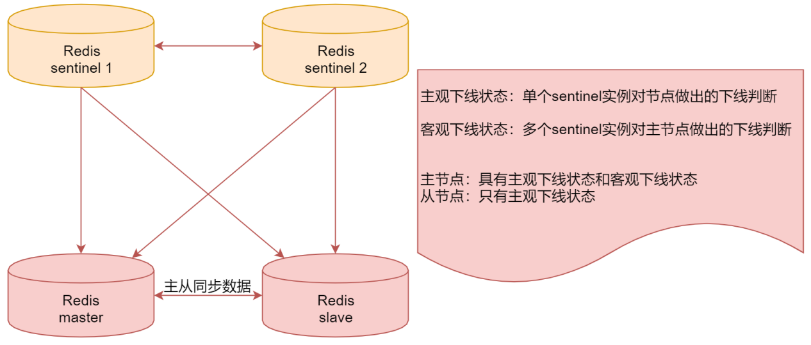

# 第10章 Redis

## 1 Redis简介

- Redis是一种面向`Key-Value`数据类型的内存数据库
- 高性能：Redis读的速度是11W次/s，写的速度是8.1W次/s
- 原子性：保证数据的准确性
- 持久存储：支持两种方式的持久化，RDB和AOF，可以把内存中的数据持久化到磁盘中
- 支持主从：master-slave架构，可以实现负载均衡、高可用
- 支持集群：从3.0版本开始支持
- 主要应用在高并发和实时请求的场景

## 2 Redis部署

### 2.1 下载并本地编译

访问[Redis官网](http://download.redis.io/releases/)，下载`redis-5.0.9.tar.gz`安装包，在`/data/soft`目录下解压并修改配置文件

```shell
cd /data/soft
tar -xvf redis-5.0.9.tar.gz
cd redis-5.0.9
apt-get install gcc
make
make install
```

### 2.2 修改redis.conf配置文件

```shell
daemonize yes
logfile /data/soft/redis-5.0.9/log
bind 127.0.0.1 192.168.56.101
```

### 2.3 启动Redis

```shell
cd /data/soft/redis-5.0.9/
redis-server redis.conf
```

## 3 Redis基本命令

- keys：获取符合规则的键
- scan：用于迭代当前数据库中的key集合
- type：获取键值的类型
- exist：判断键是否存在
- del：删除键
- select：切换数据库
- flushdb：清空当前数据库
- flushall：清空所有数据库

## 4 Redis数据类型

### 4.1 String

- `set key value`：给key设置一个Value(字符串类型的)
- `get key`：获取key的值
- `incr key`：对key的值递加+1(值必须是数字)
- `decr key`：对key的值递减-1(值必须是数字)
- `strlen key`：获取key值的长度

### 4.2 hash

- `hset key field value`：向hash中添加字段和值
- `hget key field`：获取hash中指定字段的值
- `hgetall key`：获取hash中所有的字段和值
- `hexists key field`：判断hash中是否包含指定字段
- `hincrby key field num`：对hash中指定字段的值递增
- `hdel key field`：删除hash中指定的字段
- `hkeys/hvals key`：获取hash中所有字段或字段值
- `hlen key`：获取hash中所有字段的数量

### 4.3 list

- `lpush key value`：从列表左侧添加元素
- `rpush key value`：从列表右侧添加元素
- `lpop key`：从列表左侧弹出元素
- `rpop key`：从列表右侧弹出元素
- `llen key`：获取列表的长度
- `lrange key start stop`：获取列表指定区间的元素
- `lindex key index`：获取列表指定角标的元素
- `lset key index value`：修改列表中指定角标的元素

### 4.4 set

- `sadd key value`：向集合中添加元素
- `smembers key`：获取集合中所有元素
- `srem key value`：从集合中删除指定元素
- `sismember key value`：判断集合中是否包含指定元素
- `sdiff key1 key2`：获取两个集合的差集
- `sinter key1 key2`：获取两个集合的交集
- `sunion key1 key2`：获取两个集合的并集
- `scard key`：获取集合中元素的数量

### 4.5 sorted set

- `zadd key value`：向集合中添加元素
- `zscore key value`：获取集合中指定元素的分值
- `zrange key value`：获取集合指定元素的排名(正序)
- `zrevrange`：格式同上，获取集合指定元素的排名(倒序)
- `zincrby key num value`：给集合中指定元素增加分值
- `zcard key`：获取集合中元素的数量
- `zrem key value`：从集合中删除指定元素

## 5 Redis高级特性

### 5.1 expire生存时间

- 应用场景：手机验证码
- `expire key seconds`：设置key的过期时间(单位：秒)
- `ttl key`：获取key的剩余有效时间
- `persist key`：取消key的过期时间
- `expireat key timestamp`：设置UNIX时间戳的过期时间

### 5.2 Redis持久化

- RDB持久化：通过快照完成的，当符合一定条件时Redis会自动将内存中的所有数据执行快照操作并存储到硬盘上，默认存储在`dump.rdb`文件中
- AOF持久化：通过日志文件的方式，默认情况下没有开启，可以通过`appendonly`参数开启

### 5.3 Redis安全策略

- 设置数据库密码：在`redis.conf`中设置`requirepass admin`
- 禁用`flushall`命令：在`redis.conf`中设置`rename-command flushall ""`

## 6 Redis架构演变

### 6.1 Redis主从复制机制

- Redis的复制功能支持多个数据库之间的数据同步
- 通过Redis的复制功能可以很好的实现数据库的读写分离，提高服务器的负载能力

### 6.2 Sentinel哨兵机制

- 监控：Sentinel实时监控主服务器和从服务器运行状态。
- 提醒：当被监控的某个Redis服务器出现问题时，可以向系统管理员发送通知， 也可以通过API向其他程序发送通知。
- 自动故障转移：当一个主服务器不能正常工作时，可以将一个从服务器升级为主服务器， 并对其它从服务器进行配置，让它们使用新的主服务器。



### 6.3 集群模式

- 一个Redis集群包含16384个哈希槽（hash slot）
- 使用公式 $CRC16(key) \% 16384$ 来计算键 key 属于哪个槽
- 集群架构里面已经包含了主从架构和sentinel的功能，不需要单独配置