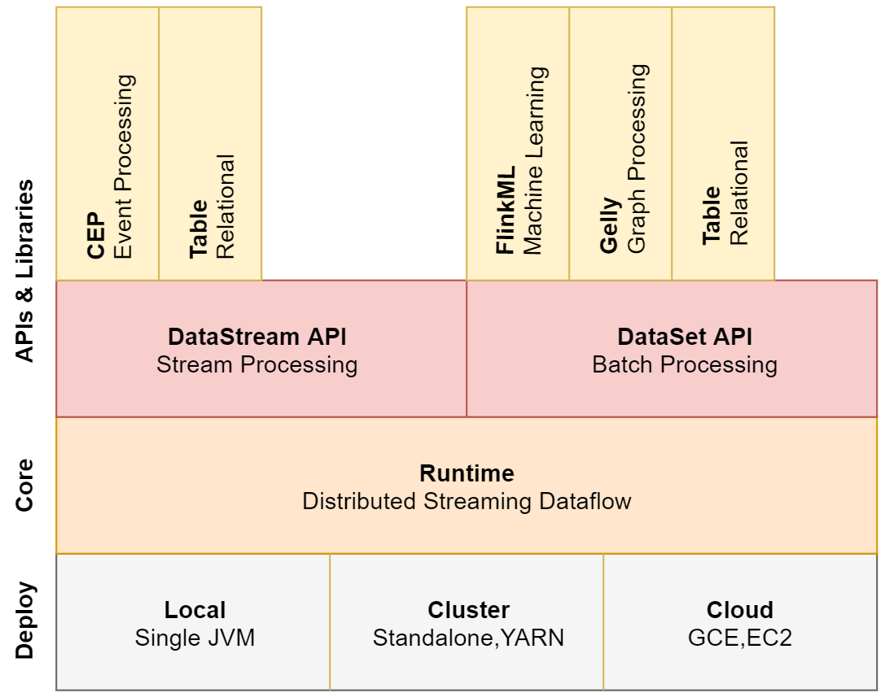

# 第11章 Flink

## 1 Flink简介

- Flink是一个开源的分布式、高性能、高可用、准确的流处理框架
- Flink支持流处理和批处理

### 1.1 Flink架构



- DataStram API：支持复杂事件处理和table操作
- 对DatasetAPI：支持flinkML机器学习、Gelly图计算、table操作

### 1.2 Flink三大核心组件

- Data Source：数据源，负责接收数据
- Transformations：算子，负责对数据进行处理
- Data Sink：输出组件，负责将计算好的数据输出到其它存储介质中

### 1.3 Flink的流处理和批处理

- 流处理：当一条数据被处理完成后，序列化到缓存中，然后立刻通过网络传输到下一个节点，由下一个节点继续处理，即一条一条处理
- 批处理：当一条数据被处理完成后，序列化到缓存中，并不会立刻通过网络传输到下一个节点，当缓存写满的时候，就持久化到本地硬盘上，当所有数据都被处理完成后，才开始将处理后的数据通过网络传输到下一个节点
- Flink采用缓存块为单位的传输形式，如果缓存块的超时值为0，则为流处理（低延迟）；如果超时值为无限大，则为批处理（高吞吐量）

### 1.4 Storm vs SparkStreaming vs Flink

|   产品   |     Strom     | sparkStreaming |    Flink     |
| :------: | :-----------: | :------------: | :----------: |
|   模型   |    Native     |  Mirco-Batch   |    Native    |
|   API    |    组合式     |     声明式     |    声明式    |
|   语义   | At-least-once |  Exectly-once  | Exectly-once |
| 容错机制 |      Ack      |   Checkpoint   |  Checkpoint  |
| 状态管理 |      无       |  基于DStream   |   基于操作   |
|   延时   |      Low      |     Medium     |     Low      |
|  吞吐量  |      Low      |      High      |     High     |

### 1.5 选择实时计算框架的建议

1. 需要关注流数据是否需要进行状态管理
2. 消息语义是否有特殊要求At-least-once或者Exectly-once
3. 如果是小型独立的项目，需要低延迟的场景，建议使用Storm
4. 如果项目中已经使用了Spark，并且秒级别的实时处理可以满足需求，建议使用SparkStreaming
5. 要求消息语义为Exectly-once，数据量较大，要求高吞吐低延迟，需要进行状态管理，建议选择Flink

## 2 Flink Job开发步骤

1. 获得一个执行环境
2. 加载/创建 初始化数据
3. 指定操作数据的transaction算子
4. 指定数据目的地
5. 调用execute()触发执行程序

## 3 Flink部署

该部署方式为Flink ON YARN模式


### 3.1 下载并解压安装包

访问[Flink官网](https://flink.apache.org/zh/downloads.html#flink)，下载flink-1.11.1-bin-scala_2.12.tgz安装包，在`/data/soft`目录下解压

```shell
cd /data/soft
tar -xvf flink-1.11.1-bin-scala_2.12.tgz
cd flink-1.11.1/conf
```

### 3.2 添加HADOOP_CLASS环境变量

在`/etc/profile`文件中添加如下内容
```shell
export HADOOP_CLASSPATH=`${HADOOP_HOME}/bin/hadoop classpath`
```

### 3.3 配置Flink日志
在conf目录下的`flink-conf.yaml`文件，修改以下内容：
```yaml
jobmanager.archive.fs.dir: hdfs://bigdata01:9000/completed-jobs/
historyserver.web.address: 192.168.56.101
historyserver.web.port: 8082
historyserver.archive.fs.dir: hdfs://bigdata01:9000/completed-jobs/
historyserver.archive.fs.refresh-interval: 10000
```

### 3.4 启动Flink日志进程
```shell
cd /data/soft/flink-1.11.1
bin/historyserver.sh start
```

### 3.5 创建Flink集群并提交任务
该命令可以创建一个临时的Flink集群，并提交任务
```shell
bin/flink run -m yarn-cluster -yjm 1024 -ytm 1024 ./examples/batch/WordCount.jar
```

## 4 Flink核心API

- 低级API(Stateful Stream Processing)：提供了对时间和状态的细粒度控制，简洁性和易用性较差，主要应用在一些复杂事件处理逻辑上。
- 核心API(DataStream/DataSet API)：主要提供了针对流数据和批数据的处理，是对低级API进行了一些封装，提供了filter、sum、max、min等高级函数。
- Table API：一般与DataSet或者DataStream紧密关联，可以通过一个DataSet或DataStream创建出一个Table，然后再使用类似于filter、join、select这种操作。最后还可以将一个Table对象转成DataSet或DataStream。
- SQL：Flink的SQL底层是基于Apache Calcite，Apache Calcite实现了标准的SQL，使用起来比其他API更加灵活，因为可以直接使用SQL语句。Table API和SQL可以很容易地结合在一块使用，因为它们都返回Table对象。

### 4.1 DataStream API

- DataStream API主要分为3块：DataSource、Transformation、DataSink
- DataSource：程序的输入数据源。
- Transformation：具体的操作，它对一个或多个输入数据源进行计算处理，例如map、flatMap和filter等操作。
- DataSink：程序的输出，它可以把Transformation处理之后的数据输出到指定的存储介质中。

#### 4.1.1 Transformation

- `union`：合并多个流，多个流的数据类型必须一致
- `connect`：只能连接两个流，两个流的数据类型可以不同
- `split`：根据规则把一个数据流切分为多个流
- `shuffle`：随机分区
- `rebalance`：对数据集进行再平衡，重分区，消除数据倾斜
- `rescale`：重分区
- `partitionCustom`：自定义分区

#### 4.1.2 DataSink

- `writeAsText()`：将元素以字符串形式逐行写入，这些字符串通过调用每个元素的`toString()`方法来获取
- `print()`：打印每个元素的`toString()`方法的值到标准输出
- 提供了一些Connectors，可以实现输出到第三方组件中

### 4.2 DataSet API

#### 4.2.1 DataSource

- 基于集合：fromCollection(Collection)
- 基于文件：readTextFile(path)

#### 4.2.2 Transformation

- `distinct`：返回数据集中去重之后的元素
- `join`：内连接
- `outerJoin`：外连接
- `cross`：获取两个数据集的笛卡尔积
- `union`：返回多个数据集的总和，数据类型需要一致
- `first-n`：获取集合中的前N个元素

### 4.3 Table API

1. 使用DataStream创建表，主要包含下面两种情况
    - 使用DataStream创建view视图
    - 使用DataS创建table对象

2. 使用DataSet创建表

	注意：此时只能使用旧的执行引擎，新的Blink执行引擎不支持和DataSet转换

3. 将表转换成DataStream

	流式查询的结果Table会被动态的更新，即每个新的记录到达输入流时结果就会发生变化，因此，转换此动态查询的DataStream需要对表的更新进行编码
    - Append Mode：这种模式只适用于当动态表仅由INERT这种操作进行修改时，之前添加的数据不会被更新
    - Retract Mode：可以使用使用此模式，它使用一个Boolean标识来编码INSERT和DELETE操作

4. 将表转换成DataSet